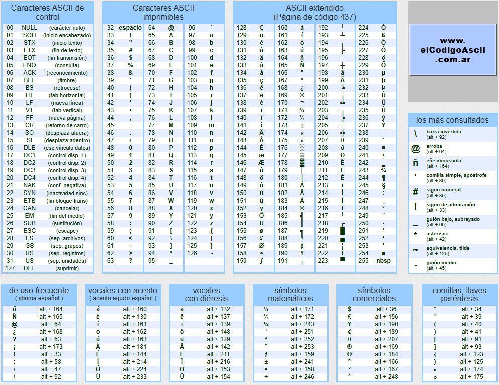
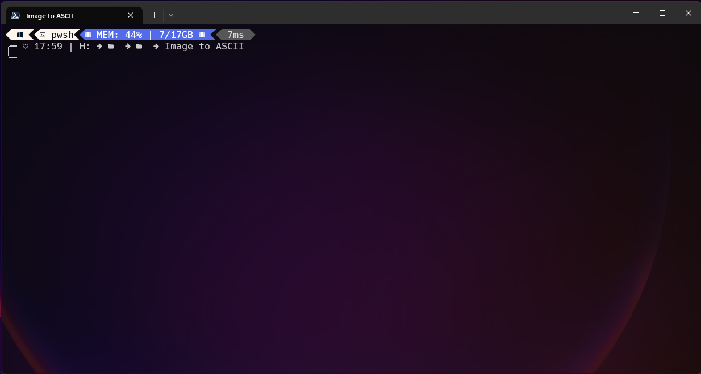
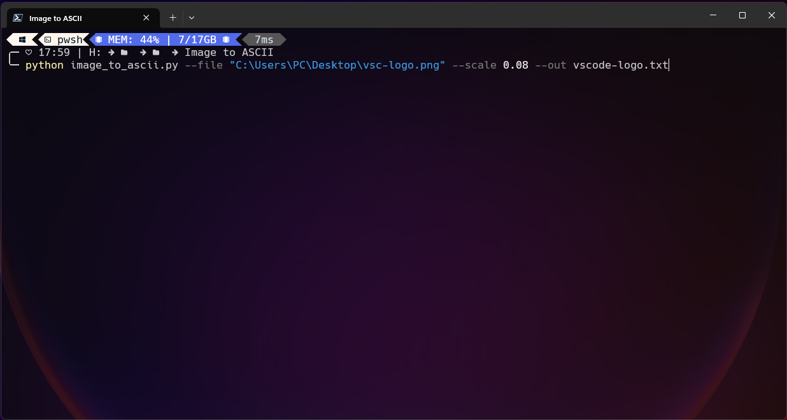
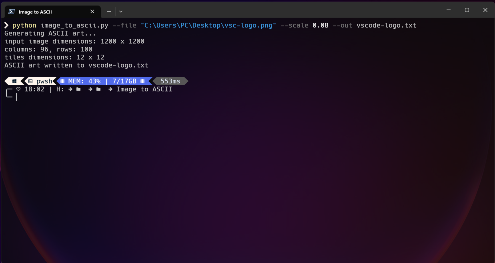
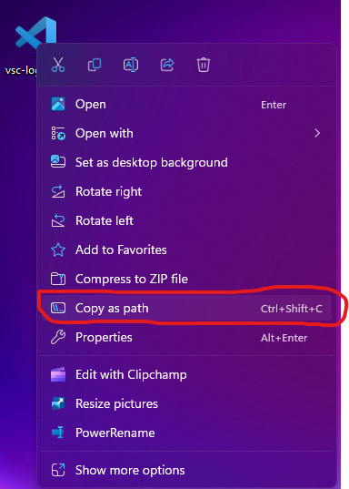

# Image to ASCII Art Converter 🖼️
Basic porgram that converts images to ASCII characters.

## What is ASCII? ⌨️
ASCII is the abreviation of **A**merican **S**tandard **C**ode for **I**nformation **I**nterchangable.
It is the way of how computers understand when we type some text, number or symbols, representing them as numbers.

Here's an example:



## ASCII ART 🖼️
So, understanding what ASCII is, as you may thinking right now ASCII art is the way of making illustrations, designs or any other visual form using the ASCII characters.

For example:

```
.................................................................
.................................................................
.................................................................
..............................-=**####*=:........................
..........................:+#@@@@@@@@@@@@%+:.....................
........................:*@@@@@@@@@@@@@@@@@@#-...................
.......................=%@@@@@@@@@@@@@@@@@@@@@*..................
.....................:#@@@@@@@@@@@@@@@@@@@@@@@@%:................
....................-%@@@@@@@@@@@@@@@@@@@@@@@@@@%-...............
...................-@@@@@@@@@@@@@@@@@@@@@@@@@@@@@@-..............
..................:%@@@@@@@@@@@@@@@@@@@@@@@@@@@@@@%:.............
..................%@@@@@@@@@@@@@@@@@@@@@@@@@@@@@@@@#.............
.................+@@@@@@@@@@@@@@@@@@@@@@@@@@@@@@@@@@-............
................:@@@@@@@@@@@@@@@@@@@@@@@@@@@@@@@@@@@#............
................*@@@@@@@@@@@@@@@@@@@@@@@@@@@@@@@@@@@@-...........
...............:@@@@@@@@@@@@@@%@@@@@@@@@@@@@@@@@@@@@@*...........
...............+@@@@@@@@@@@@#+=@@@@@@@@@@@@@@@@@@@@@@%...........
...............#@@@@@@@@@@@@+==%%@@@@@@@@@@@@@@@@@@@@@:..........
..............:@@@@@@@@@@@@@+==##@@@@@@@@@@@@@@@@@@@@@=..........
..............=@@@@@@@@%@@@%+==**@@@@%@@@@@@@@@@@@@@@@+..........
..............+@@@@@@@@#@@@*===*+@@@@#@#@@@@%@@@@@@@@@*..........
..............*@@@@@@@@*@@@+=--+=%@@@+%+@@@@#%@@@@@@@@#..........
..............#@@@@@@@@+@%%==:-==###%+*=%%@@*#@@@@@@@@#..........
..............#@@@@@@@%=%*##*+---======+##%%**%@@@@@@@#..........
..............#@@@@@@#%#%#*++=-:::::---=--=+###%@@@@@@#..........
..............*@@@@@%**==---==-::::::::::::::-=*@@@@@@*..........
..............*@@@@%*===:::::-=::::::::==:::::-+@@@@@@*..........
..............+@@@@%==--=#%%#=::::::::-=+###+::-@@@@@@+..........
..............-@@@@%==-**#%**-::::::::--=#####--%@@@@@=..........
..............:@@%@@==-#=#%#*::::::::::::#%%#=%-%%@@%@-..........
...............%@+*#==:-:*##+::::::::::::*##+:--@#%%%@:..........
...............*@+++==::-=+-:::::::::::::-=+=-:-@@#%@%...........
...............=@%=+==-::::::::::::::::::::::::=@%##@#...........
................@@#=+=-::::::::::::::::::::::::=%%@%@*...........
................-@@%=+=::::::::::::::::::::::::=%@@@%=...........
.................%@@@%=-:::::::::-==:::::::::::+@@@@=............
.................=@@@@+-::::::::::=-:::::::::::#@@@@:............
..................%@@@%=-:::::::::-:::::::::::+@@@@%.............
..................=@@@@#=:::::::::--:::::::::=@@@@@*.............
...................@@@@@#=::::::::::::::::::-%@@@@@=.............
...................%+@@@@%=-:::::::::::::::=%@@@@@@-.............
...................*.@@@@@@*-:::::::::::::+@@@@@@@@:.............
...................-.+#@%@@@*=-:::::::::=+@@@%@@@@@..............
........................::=:+=+=-:::--=+=+*=*+*%@@%..............
...........................:+===++++++===+.....+@@#..............
........................+#@@#============+*=:..+@@+..............
.......................+@@@@#===========-+@@@=.*@@=..............
......................-@@@@@%+=========-:+@@@@.*@@-..............
......................%@@@@@@@@%%#*+==-:=#@@@@+#@@...............
.....................*@@@@@@@@@@@@@@@@%@@@@@@@@%@#...............
....................=@@@@@@@@@@@@@@@@@@@@@@@@@@@@+...............
..................-+@@@@@@@@@@@@@@@@@@@@@@@@@@@@@-...............
................:%@@@@@@@@@@@@@@@@@@@@@@@@@@@@@@@*:..............
...............-@@@@@@@@@@@@@@@@@@@@@@@@@@@@@@@@@@@=.............
.............-*@@@@@@@@@@@@@@@@@@@@@@@@@@@@@@@@@@@@@@*-..........
...........-#@@@@@@@@@@@@@@@@@@@@@@@@@@@@@@@@@@@@@@@@@@@*-.......
..........*@@@@@@@@@@@@@@@@@@@@@@@@@@@@@@@@@@@@@@@@@@@@@@@%-.....
.........+@@@@@@@@@@@@@@@@@@@@@@@@@@@@@@@@@@@@@@@@@@@@@@@@@@-....
........:@@@@@@@@@@@@@@@@@@@@@@@@@@@@@@@@@@@@@@@@@@@@@@@@@@@%....
........#@@@@@@@@@@@@@@@@@@@@@@@@@@@@@@@@@@@@@@@@@@@@@@@@@@@@-...
.......:@@@@@@@@@@@@@@@@@@@@@@@@@@@@@@@@@@@@@@@@@@@@@@@@@@@@@+...
.......=@@@@@@@@@@@@@@@@@@@@@@@@@@@@@@@@@@@@@@@@@@@@@@@@@@@@@*...
.......#@@@@@@@@@@@@@@@@@@@@@@@@@@@@@@@@@@@@@@@@@@@@@@@@@@@@@%...
.......@@@@@@@@@@@@@@@@@@@@@@@@@@@@@@@@@@@@@@@@@@@@@@@@@@@@@@@...
......-@@@@@@@@@@@@@@@@@@@@@@@@@@@@@@@@@@@@@@@@@@@@@@@@@@@@@@@...
......+@@@@@@@@@@@@@@@@@@@@@@@@@@@@@@@@@@@@@@@@@@@@@@@@@@@@@@@:..
......#@@@@@@@@@@@@@@@@@@@@@@@@@@@@@@@@@@@@@@@@@@@@@@@@@@@@@@@-..
......@@@@@@@@@@@@@@@@@@@@@@@@@@@@@@@@@@@@@@@@@@@@@@@@@@@@@@@@=..
.....:@@@@@@@@@@@@@@@@@@@@@@@@@@@@@@@@@@@@@@@@@@@@@@@@@@@@@@@@*..
.....-@@@@@@@@@@@@@@@@@@@@@@@@@@@@@@@@@@@@@@@@@@@@@@@@@@@@@@@@#..
......:::::::::::::::::::::::::::::::::::::::::::::::::::::::::..
.................................................................
.................................................................
```

## How does the code works?
To use this script follow these steps:

1- Open your favorite terminal:



2- Type the following line:
```
python --file yourImageFilePath.jpg --scale 0.5 --out imageToAscii.txt
```
*Replace the yourImageFilePath.jpg with tha path of the image you want to use.*


3- Then press **Enter** and it's **Done!!** you have your image converted into an ASCII art version.



~~~
@@@@@@@@@@@@@@@@#+*@@@@@
@@@@@@@@@@@@@@@#++==*%@@
@@@@@@@@@@@@@@#++*====+%
@@@@@@@@@@@@@*+++*=====+
@@@@@@@@@@@@*+++**======
@@@@@@@@@@@*******======
@*+#@@@@@@********======
*+++*@@@@*******#@======
*++++*%%*******%@@======
@*+++++*******@@@@======
@@#+++++****#@@@@@======
@@@#+++++**%@@@@@@======
@@@#*+++++*%@@@@@@======
@@#*********#@@@@@++++++
@#************@@@@++++++
#*****@%*******%@@++++++
#***#@@@@*******#@++++++
@#*%@@@@@@********++++++
@@@@@@@@@@@*******++++++
@@@@@@@@@@@@#*****++++++
@@@@@@@@@@@@@#****++++++
@@@@@@@@@@@@@@#***++++*@
@@@@@@@@@@@@@@@#**++*@@@
@@@@@@@@@@@@@@@@%*#@@@@@
~~~

### Explanation of the code line 🤓
First we invoke the python interpreter using `python`.

Then we type `--file` and we copy our image path. You can do this typing it or copying in the following way:



The next step is to specify the scale that we want our ASCII file to have, using the `--scale` and adding the scale number.

The last step is to type `--out` add a name to our file and specify the file extention. These can be .txt, .md or any other text files, you could also use a programming langauge extension file but sometimes may have bugs.

Maybe the next time I'll try to make a version with GUI, but currently I'm not promising anything.